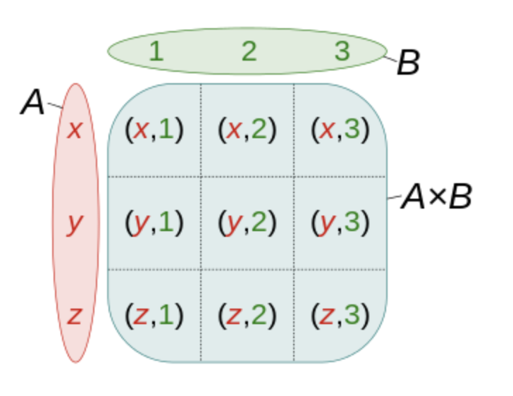
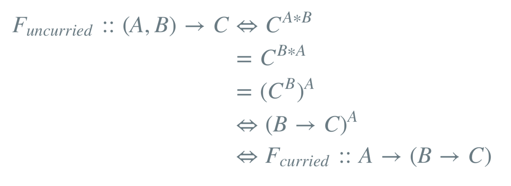

本文内容是对Ben Deane在CppCon2016做的演讲的总结。

感兴趣的同学可以在Youtube看整个的演讲，全长55分钟，或者也可以花个10+分钟看看我做的总结:)

在C++的演进中，类型系统的完善一直是一个重点。高效地使用类型，可以帮助我们：

1. 让代码表达性更好（more expressive）；
2. 让非法行为引起类型错误；
3. 让非法的状态不可表达；
4. 定义清晰的接口（降低被误用的可能性）。

其中第2、3点，可以提高程序的健壮性，帮助开发者减少需要测试的case数目，减少测试代码。

## 什么是类型?

类型是值的集合。

从这个角度，可以用代数的思维去看待类型。

### compound type

多个类型组合成一个类型的时候，我们叫这个类型组合类型（compound type）

#### product type

如果组合类型是子类型值集合的笛卡尔乘积，我们称这个类型是product type。或者简单地看，组合类型的值个数是其子类型的值个数的乘积。比如下面的示例：

```cpp
std::pair<char, char>;
// 值个数：256 * 256

std::tuple<bool, bool, bool>;
// 值个数：2 * 2 * 2

template <typename T, typename U>
struct Foo {
    T m_t;
    U m_u;
};
// 值个数：|U| * |T|
```

从集合论的角度理解，如图，A、B是两个类型，则他们的笛卡尔积包含如图9个值：



#### sum type

类似的，如果一个组合类型的值个数是子类型值个数的和，那么可以称这个组合类型为sum type。

比如：

```cpp
std::optional<char>;
// 值个数：256 + 1

std::variant<char, bool>;
// 值个数：256 + 2

template <typename T, typename U>
struct Foo {
    std::variant<T, U>;
}
// 值个数：|T| + |U|
```

#### function type

函数也可以看作是一个类型，比如C的函数指针、C++的std::funtion。那么函数类型的值个数怎么计算呢？

```cpp
bool f(bool);
// 值个数：2 ^ 2 = 4

char f(bool);
// 值个数：256 ^ 2 = 65,536

template <class T, class U>
U f(T);
// 值个数：|U| ^ |T|
```

比如考虑函数char f(bool)，对于参数true，可以返回256个char值中的任意一个，对于参数false，也可以返回256个char值中的任意一个。那对于值集合(true, false)，则可能返回256 * 256个char值组合（aa, ab, ac, ad..etc..）。

好玩的是，函数式编程有个柯里化（currying）的概念，即把接受多个参数的函数变换成接受一个单一参数（最初函数的第一个参数）的函数，用scheme表示：

```cpp
(lambda (x y)
  (+ x y))
; 可变换成
(lambda (x)
  (lambda (y)
    (+ x y)))
```

然后这个柯里化刚好和function type的集合运算对应上了！



## variant & optional

variant和optional是C++17新增的两个强有力的类型工具。

variant可以看做一个更加健壮、安全的union，可以用来表达多个类型的sum type。在对状态的表达上，合理使用variant可以使状态更加自然、符合实际。举个例子：

```cpp
enum class AggroState {
    IDLE,
    CHASING,
    FIGHTING
};
class MonsterAI {
    AggroState m_aggroState;
    float m_aggroRadius;
    PlayerId m_target;
    Timer m_chaseTimer;
};
```

作为游戏中的一个MonsterAI类，有三种状态IDLE、CHASING、FIGHTING，但在特定的状态下，一些成员变量是没有用。比如在IDLE和FIGHTING状态下，怪物不需要追逐任何东西，m_chaseTimer是没用的。在CHASING和FIGHTING状态下，怪物不需要探测半径内的玩家，m_aggroRadius是没用的。相信这种情况C++开发者都会遇到过。

这里的风险在于，如果有个用户误用了这个类，在IDLE状态下Get了m_chaseTimer，而这个m_chaseTimer是没有意义的。通常做法是加个assert，然后通过测试避免这样的误用。但如果能更合理地设计这个类，我们根本就不需要写这个assert和测试！

问题根源是这里的各个成员变量，组合成了一个product type，其值个数远远超过了实际需要的值。这些我们不需要的值，其实就是非法的状态！我们实际更需要的是一个sum type，此时variant就可以发挥作用了：

```cpp
class MonsterAI {
    struct Idle {
        float m_aggroRadius;
    };
    struct Chasing {
        PlayerId m_target;
        Timer m_chaseTimer;
    };
    struct Fighting {
        PlayerId m_target;
    };
    std::variant<Idle, Chasing, Fighting> m_aggroState;
};
```

不同的状态可以对应不同的成员变量，值集合的大小被缩小到更加符合实际的情况。换句话说，我们让那些非法的状态不可表达了！

optional也是类似的，在没有optional前，表达一个成员是否存在，会有这样的做法：

```cpp
private:
    bool flag_exist;
    char flag;
```

但如果有用户误用，可能会在flag_exist为false的时候获取flag。与上一个例子一样，这里的product type应该换成sum type。

```cpp
std::optional<char> flag
```

## 使用类型约束程序的行为

类型系统也可以用于约束程序的行为，不合法的行为会导致编译器报类型错误。

演讲中通过一个叫**Phantom types**的技术来举例：

```cpp
std::string GetFormData();
std::string SanitizeFormData(const std::string&);
void ExecuteQuery(const std::string&);
```

FormData必须经过Sanitize（检查）后才能被Execute，比如防SQL注入之类的。但是代码无法保证这点，用户是有可能调用GerFormData后就直接ExecuteQuery了，这是一个潜在的隐患。

使用Phantom types后：

```cpp
template <typename T>
explicit FormData(const string& input) : m_input(input) {}
    std::string m_input;
};
struct sanitized {};
struct unsanitized {};
// 知道为什么叫**Phantom** type了吧。。

FormData<unsanitized> GetFormData();
std::optional<FormData<sanitized>> SanitizeFormData(const FormData<unsanitized>&);
void ExecuteQuery(const FormData<sanitized>&);
```

这样通过两个空的类型，我们保证了ExecuteQuery的输入只会接受经过检查的FormData。

## Total Function

如果一个函数能够处理所有可能的输入值，则可以称这个函数为total function。另一个角度去理解，即没有前置条件（precondition）的函数。比如常用的：

```cpp
T& vector<T>::front();
```

这就是一个有前置条件的函数，因为如果vector为空，front()函数是无法处理的，用户必须在调用front()前检查vector是否为空，所以front函数不是一个total function，而是一个partial function。那么如何把该函数改写成total function呢？

```cpp
std::optional<T> vector<T>::front();
```

通过定义total function，可以避免代码产生意料之外的影响。

在演讲中Ben Deane让听众做了一个小游戏，给出一个函数的类型签名，给这个函数命名。各位也可以轻松猜下（不需要复杂的思考）

```cpp
// 1.
template <typename T>
T f(T);

// 2.
template <typename T, typename U>
T f(pair<T, U>);

// 3.
template <typename T>
T f(bool, T, T);

// 4.
template <typename T, typename U>
U f(function<U(T)>, T);

// 5.
template <typename T>
vector<T> f(vector<T>);

// 6.
template <typename T, typename U>
vector<U> f(function<U(T)>, vector<T>);

// 7.
template <typename K, typename V>
V f(map<K, V>, K);

// answers:
// 1. identity
// 2. first
// 3. select
// 4. apply
// 5. reverse, sort, shuffle..
// 6. map, or transfrom
// 7. Not possible! (The key might not be in the map.)
//    maybe we can change it to: 
template <typename K, typename V>
optional<V> f(map<K, V>, K);
```

在不了解函数名、参数名的情况下，我们仍然可以通过函数的类型签名得出很多信息，甚至知道它会如何实现。通过把接口定义成类型合理的total function，用户（或者编译器）可以仅仅从类型信息就得知这个接口的功能，同时这个接口也会更加安全、难以误用。

比如C++程序员常用的一个partial function：

```cpp
V& map<K, V>::operator[](const K&);
```

当用户提供的key不存在的时候，map会在key上调用V的默认构造函数并返回。不知道各位读者第一次知道这个特性的时候，有没有感觉到疑惑？一个不存在的key，居然还能成功返回一个value？

实际上，把这个函数设计成一个total function会更加合理：

```cpp
optional<V> map<K, V>::operator[](const K&);
```

你get到了吗？
