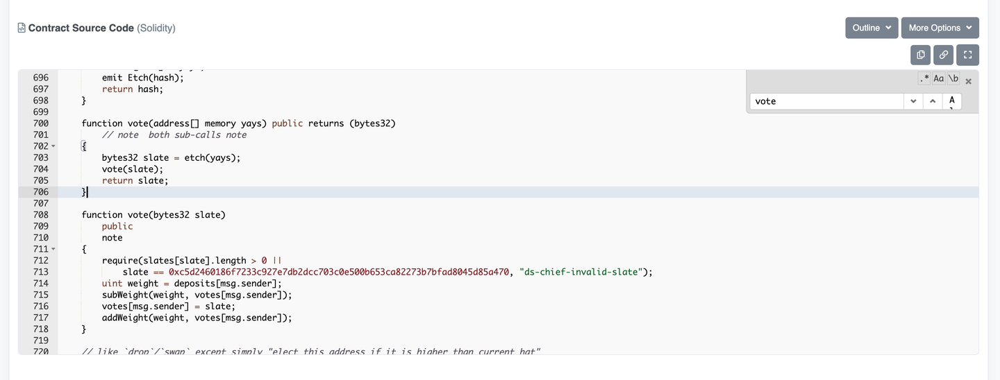
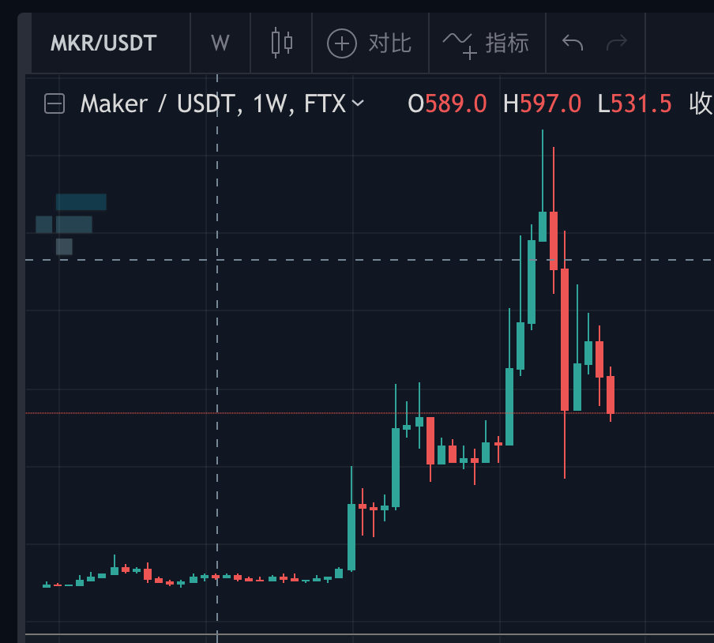
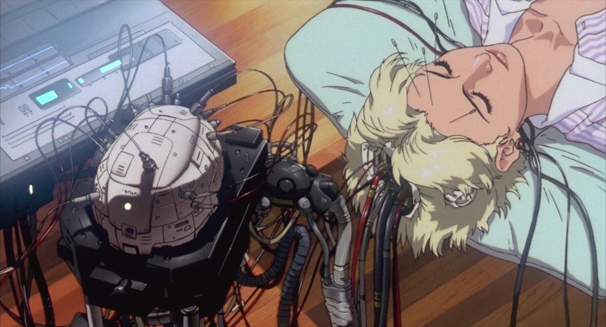

> DAO，即去中心化治理，是一个由编码为计算机程序的规则代表的组织，这个程序是公开的，由组织成员控制，不受中央实体的影响。 ——维基百科

看不太懂？对于没有接触过开源、区块链的人，是会比较难理解。但是没问题，接下来我会尽量用通俗一点的概念解释一下。

## 对比：美国大选

我们可以把DAO的初始概念，先看做一个投票系统管理的组织。现实中有很多这样的例子，比如说美国大选，每个人都能投票选总统。在DAO中也会有这样的选票，一般称之为代币（Token）。每个DAO组织里的人都能通过选票来影响组织的决策、走向。 那你可能会问了，这又有什么特别的呢？以下就是DAO相对于传统投票的优势：

- DAO的投票规则是公开透明的，写在公开的代码里。任何人都能看到这个规则。当然，不是所有人都能读懂代码。但是代码本身的公开，就证明这个投票规则里的问题是能被发现，他的公信力是能被挑战的，甚至能被黑客攻击（从长远的角度看，黑客的攻击加强了投票规则的容错性）。这和科学主义一脉相承，即不可被证否的发现不是一个有公信力的发现，科学的发展就是由一个个被证否的理论推动的；

- DAO投票的执行是去中心化的。在美国大选中，投票规则大家都知道，但是收集选票、计票都是由其他组织做的，我怎么能相信这些组织没有被政客收买？对于这点，DAO的解决办法是运行在去中心化的区块链上的，投票规则的执行是由千万个区块链节点共同执行的，执行的本身是不会受一个作恶的位高权重者或组织影响的；

- DAO的投票规则是可以快速改进的。再来一个对比，如果大家觉得美国大选现在的规则不好、不公平，比如说参与度不高、选民被收买，那该如何改进这个规则呢？除了规则的改变势必牵涉到的各个利益集团的相互扯皮外，规则更改的执行肯定也会伤筋动骨，因为牵涉到上下游太多人力物力。但是在DAO中，说白了投票规则的更改就是升级一个程序嘛，这就是计算机技术带来的好处。这背后也隐含了一个思想，“投票”本身没有问题，有问题的是投票规则，而得益于互联网和区块链等计算机技术，改进这个规则成为了一件很方便的事情。

## DAO中的正向激励

现在我们都知道DAO的这些好处了，但是我为什么要参加DAO呢？我参加美国大选投票至少能选个川宝这样的活宝娱乐一下，我参加DAO又有什么好处呢？

最简单直接的好处，当然就是金钱了。这也是问什么我在标题提到“公司”这两个字，想想为什么人会心甘情愿地接受雇佣合同、为公司打工，很大一部分原因就是为了工资。 

还记得上面提到的代币吗？代币除了是一种选票，还可以在二级市场上交易，换言之，能卖钱。

DAO会把代币奖励给对组织做出贡献的人。如果你会编程，你可以以参与开源项目的方式贡献技术。如果你会美术，你可以创作能提升组织传播度的meme。如果你是运营，你可以提出自己的策略建议。 

DAO会根据你的贡献，发放一定数量的代币作为奖励，从这个角度看，代币也是一种工资。 

聪明的读者可能会问了，我怎么知道这个代币到底是有价值的还是只是空气呢？复习一下，代币具有投票功能，能一定程度地影响组织的决策，那么这个代币的价值，自然取决于组织是否解决了很多人的需求并发展壮大。这和公司的股票是一个道理，公司发展得越好，股票的价值就会越高。

就这样，通过集选票、薪酬、股票于一体的代币，DAO可以形成正向的激励。做出贡献的人能收获代币，持有代币的人为了手中的代币升值，也会主动为组织做出贡献。在这样一个良好的激励循环下，DAO把所有成员的自利转化为自身发展的推力，这非常符合奥派经济学的思想。

## 扣下题

个人认为DAO包含的可能性会比传统的商业公司更大，但为了便于理解（以及扣题）还是先用公司来类huan比xiang一下。

以DAO形式组织的公司和传统商业公司相比有以下优点：

1. 你做出贡献得到的回报不仅仅是工资，还有对公司的决策权。随着你对公司做出的贡献越多，拥有了更多的代币，你直接的“拥有”了一部分公司，这一点对散户来说，和传统的持有一家公司股份是不一样的，因为你能通过投票直接地影响到公司的决策；
2. 在DAO中，你是自由的。你可以通过在家办公的方式来去自如地为多个DAO进行工作。由于区块链赋予的匿名性，你无需为传统的雇佣关系所绊。简而言之就是谁也管不着你，甚至你同时为两家互为竞对的DAO工作（打个比方，淘宝和京东），也没问题。这是区块链社区从开源运动继承下来的精神，在一个公开去中心化的平台上，只要你在为行业做出贡献，没人在意你是不是遵循那种传统商业公司定制的陈旧规则（比如“脚踏多条船”），一切实力说话。

## 未来的DAO：攻壳机动队

在著名的硬科幻作品——《攻壳机动队》中，电子脑的普及让所有人都可以通过大脑直接联网。这一定程度上预言了现实的趋势，我们的手机正在变的越来越像人的器官，这也引发了一些哲学家的思考。

想象一下，真到了大脑能够直接联网的时候，通过DAO，一个群体能在没有领导者的情况下通过链上的投票代码快速做出决策，这将是多么激动人心的一件事。到了那时候，可能正如Gavin Wood在演讲中提到，互联网原生的民族国家可能会诞生，甚至到最后进化成某些科幻作家笔下的星球体生命。

## 警醒：DAO的弊端

DAO并不是完美的，作为一种人治的形式，DAO显然也会有人治带来的弊端。

在这篇文章中，作者对比了DAO治理成熟的Maker和没有DAO的Liquity（两者都是通过超额抵押发行稳定币的项目），指出DAO的一些问题，包括学习曲线过于陡峭、参与度不高、过于中心化等。而DAO本身的提案、投票等耗时容易导致项目策略调整过慢，这在仍然处于蓝海、日新月异的DeFi行业，很可能是致命的。

这种公平和效率矛盾的体现，和新冠疫情中各国的表现有异曲同工之妙。是很值得观察和思考的一件事。

## 总结

以上便是我对DAO的一些介绍和理解。或许谈及互联网原生的国家现在还有点为时过早，但作为一种公司的运营模式，DAO已经在林林总总的区块链项目中进行了实践。

在个人自由与独立性逐渐增强的潮流中，传统自上而下的公司运营模式似乎已经成为一个不断修修补补的巴别塔了，在纠结使用KPI还是OKR考核的时候，何不了解和尝试一下DAO，希望你会喜欢:)
