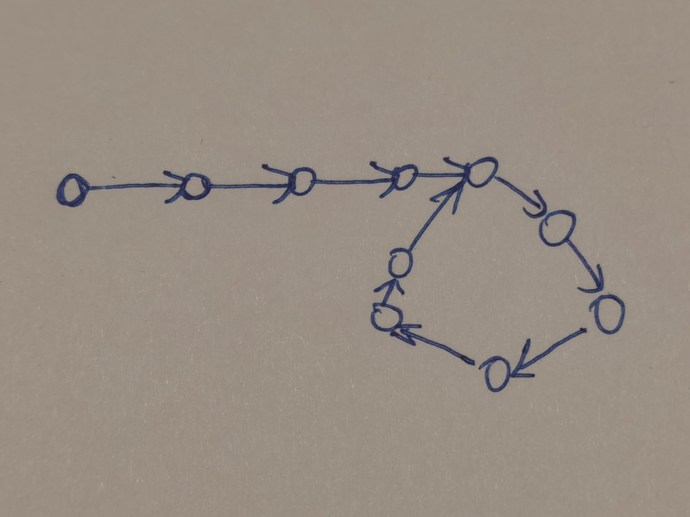
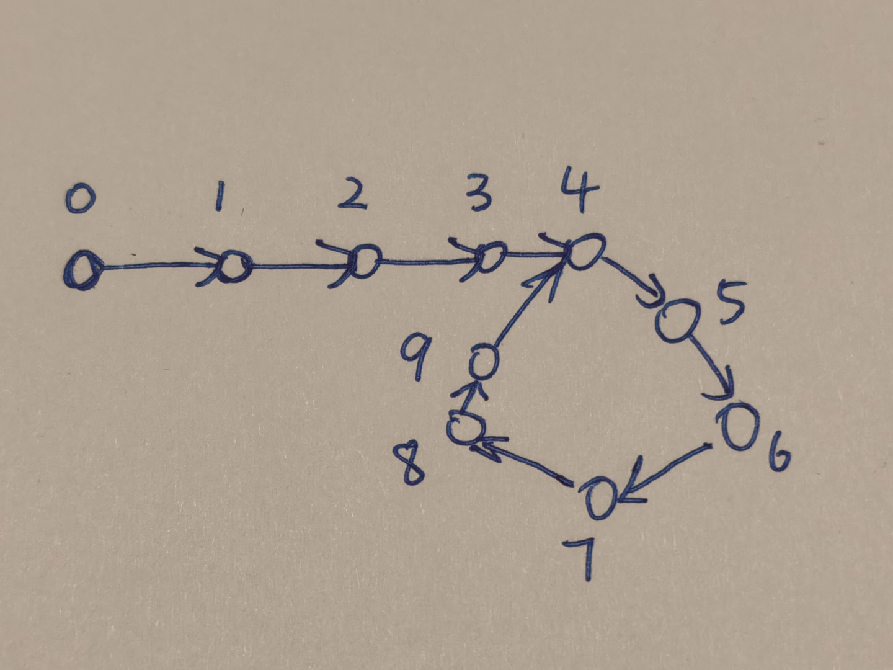
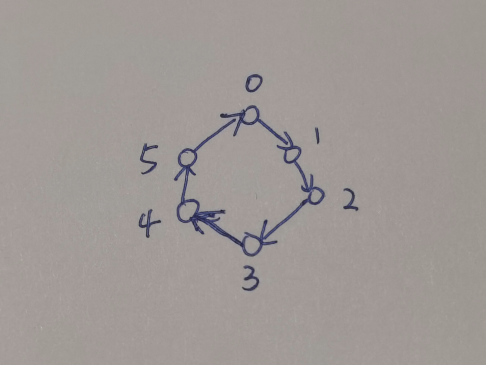

首先这道算法题相信很多人都听说过：

> 给定一个链表，返回链表开始入环的第一个节点。 如果链表无环，则返回 null。说明：不允许修改给定的链表。你是否可以不用额外空间解决此题？

经典解法就是：

定义两个指针，快指针每次走两步，慢指针一次走一步，当环存在时，则快指针一定会追上慢指针；

追上时使其中一个指针指向链头，然后两个指针同时走，则再次追上时指针的位置为环开始的位置。

但是为什么呢，如果不深入了解其中原理的话，即使强行记住解法也很容易忘记。今天我就来说一下自己证明这个解法的思路。

首先，有这么一个带环的单向链表：

我们一个一个顺序遍历这个链表上的节点，并按照顺序标记序号，直到所有的节点都标了序号：

会发现环有一个特别的性质，环上的每个节点的序号减去环入口的序号（4），会变成像时钟一样：

会发现，可以把指针在这个单向环上的遍历看成一个加法求余的运算，结果是指针最后指向的序号，比如，从0号节点移动8次，指针最后会指向：8 % 6 = 2，即2号指针。

以上余数运算就是我们证明的主要思路：

## 证明第一个算法

设移动次数为$$Step$$（移动一次慢指针走一步，快指针走两步），环入口节点的序号为$$Entry$$，环的长度为$$r$$。转换成刚才的模型，这个命题会等价于：

存在一个$$Step \geq Entry$$，使得$$Step - Entry$$和$$2 * Step - Entry$$关于$$r$$同余。即两个式子除以$$r$$ 的余数相等。数学的符号化表达为：

$$Step - Entry\equiv 2 * Step - Entry \pmod r$$
 
余数运算也支持加减乘除，那么以上等式又等价于：

$$Step\equiv 0 \pmod r$$
 

即存在一个$$Step \geq Entry$$，使得$$Step$$能被$$r$$整除。

由于$$Step$$，可以是任意大于等于$$Entry$$的数，只要是大于等于$$Entry$$的$$Nr$$都符合条件，证毕。

可以发现两个指针第一次相遇时的移动次数，就是第一个大于等于$$Entry$$的能被$$r$$整除的自然数。

## 证明第二个算法

> 追上时使其中一个指针指向链头，然后两个指针同时走，则再次追上时指针的位置为环开始的位置。

假设指向链头的指针是B，待在原处的指针是A，在B走了$$k$$步的时候，A走的步数为：

$$Step + k$$
 

此时A在环中的位置是：

$$(Step + k - Entry) \mod  r$$
 

从第一个证明得知：

$$Step = n * r$$
 

$$(Step + k - Entry) \mod r = (k - Entry) \mod  r$$
 

所以A在环中的位置是：

$$(k - Entry) \mod r$$
 

可以发现，A在环中的位置，正是指针B在环中的位置。所以可以得知，只要$$k >= Entry$$，指针A和指针B在环中的位置就是一样的、重合的。

所以两个指针第一次位置重合的时候，就是$$k = Entry$$的时候，即B走到环开始位置（$$Entry$$）的时候。
